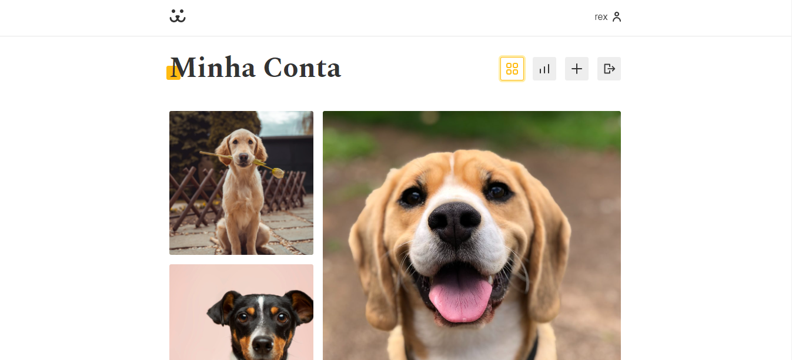

# Dogs - rede social para cachorros

## Links

- Deploy: [Clique aqui](https://dogs-nine-gamma.vercel.app/)
- Repositório: [Clique aqui](https://github.com/marcoslimaJS/Dogs)

## Design

## Descrição

Projeto Dogs rede social para cachorros, feito no curso de react completo da origamid. foi utilizado os diversos conhecimentos aprendidos ao decorrer do curso, como os principais hooks e seus benefícios, criação dos próprios hooks, e também foi usado a biblioteca externa Victory para a criação de gráficos com o lazy e suspense para evitar carregar dados desnecessários.

### Construído com

- HTML5
- CSS
- Flexbox
- CSS Grid
- [React](https://reactjs.org/) - JS biblioteca
- [Victory](https://formidable.com/open-source/victory/) - React biblioteca

## Autor

- Linkedin - [Marcos Paulo Araujo](https://www.linkedin.com/in/marcos-paulo-araujo-684aa8199/)
